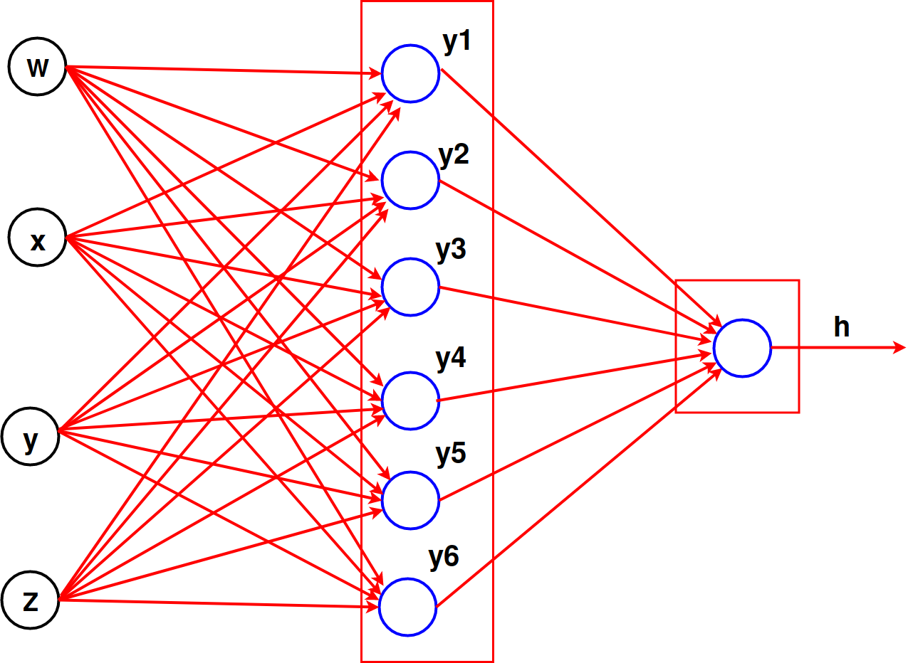
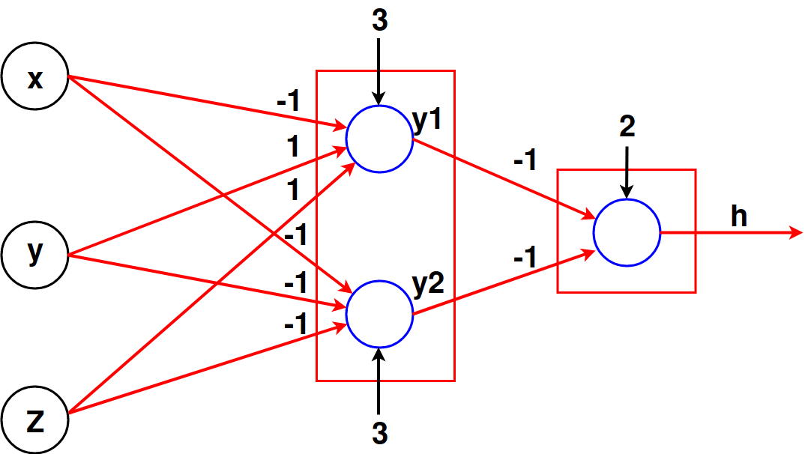
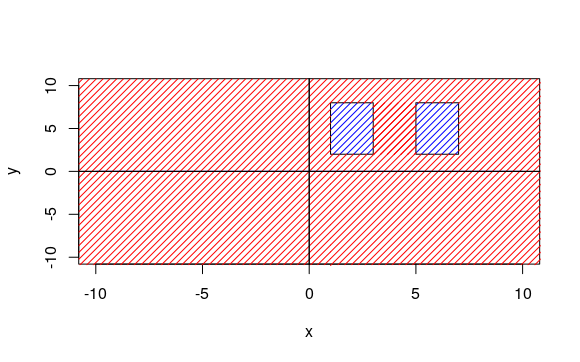
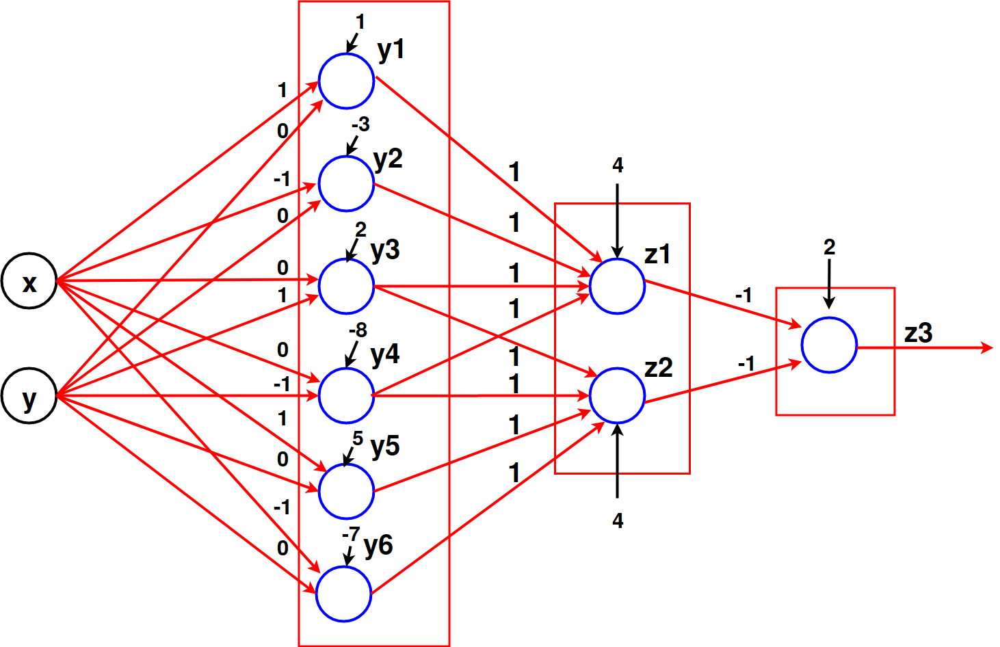
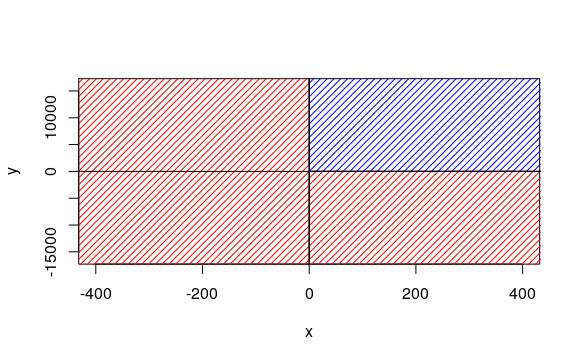
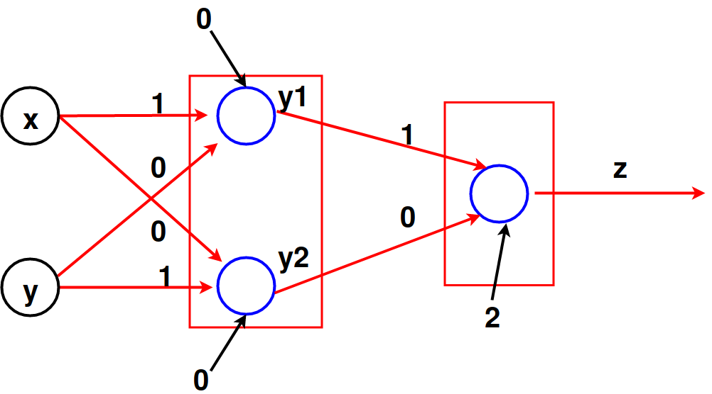
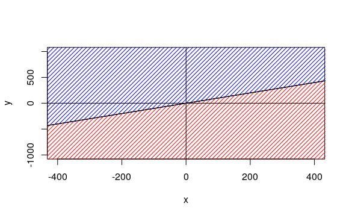
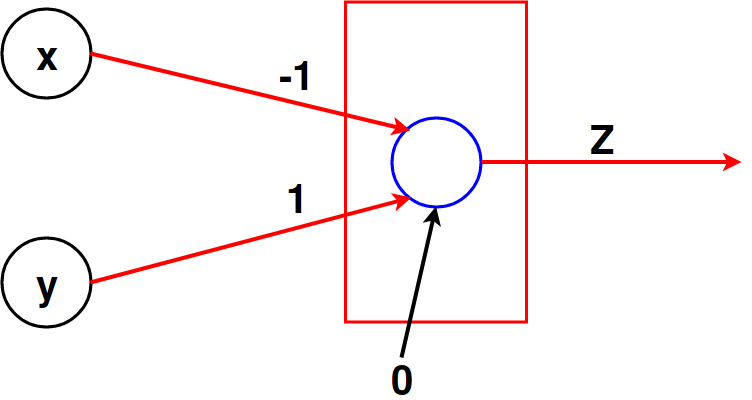

#\textcolor{blue}{Problema 1}


##\textcolor{blue}{Problema 1.1}
\begin{enumerate}[a)]

\item Suponer que la función $f:\lbrace -1,1\rbrace^{4}\to \lbrace -1,1\rbrace$, definida por $f(w,x,y,z)=1\iff w-x-y+z=0$ puede ser aprendida por un perceptrón, es decir $\exists w_1,w_2,w_3,w_4 , \theta \in \mathbb{R}$ tal que

$$f(w,x,y,z)=sign(w_1w+w_2x+w_3y+w_4 z-\theta), \quad \forall (w,x,y,z)\in \lbrace -1,1\rbrace^{4} $$

Considerar las siguientes evaluaciones de $f$:
\begin{align*} 
f(1,-1,-1,1)= sign(w_1-w_2-w_3+w_4-\theta)=-1 &\implies w_1-w_2-w_3+w_4<\theta\\
f(-1,1,1,-1)=sign(-w_1+w_2+w_3-w_4-\theta)=-1 &\implies -w_1+w_2+w_3-w_4<\theta\\
f(1,-1,1,-1)=sign(w_1-w_2+w_3-w_4-\theta)=1 &\implies w_1-w_2+w_3-w_4\geq \theta\\
f(-1,1,-1,1)=sign(-w_1+w_2-w_3+w_4-\theta)=1 &\implies -w_1+w_2-w_3+w_4\geq \theta
\end{align*}


Sumando las primeras 2 desigualdades se tiene que $\theta>0$, mientras que al sumar las 2 ultimas resulta $\theta \leq 0$, obteniéndose una contradicción, por ende $f$ \textbf{no puede ser aprendida por un perceptrón}.
\newline
Se define la red multicapas:
\begin{center}
```{r echo=FALSE, out.width='50%'}

```
\newline
Figura 1: red de 2 capas que aprende $f$.
\end{center}
La función $f$ vale 1 al evaluar en los puntos (1,1,1,1),(1,1,-1,-1),(1,-1,1,-1),(-1,1,-1,1),(-1,-1,1,1),(-1,-1,-1,-1). Esto motiva a definir las funciones: 

\bminione
\begin{align*} 
y_1(w,x,y,z)&= AND(w,x,y,z)=H(w+x+y+z-4) \\ 
y_2(w,x,y,z)&=AND(w,x,\overline{y},\overline{z})=H(w+x-y-z-4)\\
y_3(w,x,y,z)&=AND(w,\overline{x},y,\overline{z})=H(w-x+y-z-4)\\
y_4(w,x,y,z)&=AND(\overline{w},x,\overline{y},z)=H(-w+x-y+z-4)\\
y_5(w,x,y,z)&=AND(\overline{w},\overline{x},y,z)=H(-w-x+y+z-4)\\
y_6(w,x,y,z)&=AND(\overline{w},\overline{x},\overline{y},\overline{z})=H(-w-x-y-z-4) 
\end{align*}
\emini
\bminione
\begin{align*}
h&= OR(y_1,y_2,y_3,y_4,y_5,y_6)\\
 &=H(-y_1-y_2-y_3-y_4-y_5-y_6-6)
\end{align*}
\emini

Para todo $i\in \lbrace 1,..,6\rbrace$ el umbral de la función $y_i$ es 4, mientras que los pesos de cada  $y_i$ son los coeficientes que acopañan a las variables $w,x,y,z$ en el argumento de $H$.  La función $h$ presenta salida igual a la de $f$, donde los pesos para todas  sus variables de entrada ($y_1$ hasta $y_6$) son $-1$  y el umbral es $6$. Así, la red de la Figura 1 aprende $f$.
\newline
\newline


\item Sea $f:\lbrace -1,1\rbrace^{3}\to \lbrace -1,1\rbrace$, definida por $f(x,y,z)=1\iff (x=-1)\wedge (y=z)$. $f$ \textbf{no puede ser aprendida por un perceptrón}. Basta analizar el caso en que $x=1$, observando que $f(1,1,1)=1$ , $f(1,-1,-1)=1$, $f(1,1,-1)=-1$, $f(1,-1,1)=-1$. Cada uno de los puntos evaluados son una extensión de $x=1$ en los puntos (1,1),(1,-1),(-1,1),(-1,-1), los cuales  (de imagen 1,-1,-1,1) no son linealmente separables (visto en clases), por eso tampoco lo serán al extenderlos con x=1 en la primera componente. \newline
\newline
Se propone la siguiente red multicapas:
\newline
\newline
\begin{center}
```{r echo=FALSE, out.width='60%'}

```
\newline
Figura 2: red de 2 capas que aprende $f$.
\newline
\newline
\end{center}
En este caso, $y_1(x,y,z)=AND(\overline{x},y,z)=H(x+y+z-3),\; y_2(x,y,z)=AND(\overline{x},\overline{y},\overline{z})=H(-x-y-z-3)$ y $h(y_1,y_2)=OR(y_1,y_2)=H(-y_1-y_2-2)=f(x,y,z)$, por lo tanto la red aprende $f$.
\newline
\newline


\item La función  $f:\lbrace -1,1\rbrace^{3}\to \lbrace -1,1\rbrace$, definida por $f(x,y,z)=1\iff (x,y,z)=(1,-1,1)$ \textbf{puede ser aprendida por un perceptrón}, ya que $f(x,y,z)=sign(x-y+z-3)$.


\end{enumerate}


\newpage

##\textcolor{blue}{Problema 1.2}
\begin{enumerate}[a)]
\item Sea $h:\lbrace 0,1 \rbrace^{n}\to \lbrace 0,1\rbrace$ definida por $h(x)=f(x)\vee g(v)$. Esta función \textbf{no} necesariamente es función umbral. Se pueden usar las funciones umbrales, $f,g:\lbrace 0,1 \rbrace^{2}\to \lbrace 0,1\rbrace$, definidas por:


\begin{align*} 
f(x_1,x_2)&= AND(x_1 , \overline{x_2})= H(x_1-x_2-1) \\ 
g(x_1,x_2)&= AND(\overline{x_1}, x_2)= H(-x_1+x_2-1)
\end{align*}

Luego $XOR(x_1,x_2)=(x_1\wedge \overline{x_2})\vee (\overline{x_1}\wedge x_2)=f(x_1,x_2)\vee g(x_1,x_2)$, es decir $h(x_1,x_2)=XOR(x_1,x_2)$ no es función umbral (visto en clases).
\newline
\newline


\item Sea $h:\lbrace 0,1 \rbrace^{n}\to \lbrace 0,1\rbrace$ definida por $h(x)=1 \iff f(x)=g(x)$. Considerar las funciones umbrales $f(x_1,x_2)=\overline{x_1}\vee \overline{x_2}=H(-x_1-x_2+1)$ \quad  y  \quad $g(x_1,x_2)=x_1\vee x_2=H(x_1+x_2-1)$. Notar que:
\newline
\newline
\newline

\bminione
\begin{center}
\begin{tabular}{|c|c|c|c|c|}
\hline 
$x_1$ & $x_2$ & $\overline{x_1}\vee \overline{x_2}$ & $x_1 \vee x_2$ & $h$ \\ 
\hline 
0 & 0 & 1 & 0 & 0 \\ 
\hline 
0 & 1 & 1 & 1 & 1 \\ 
\hline 
1 & 0 & 1 & 1 & 1 \\ 
\hline 
1 & 1 & 0 & 1 & 0 \\ 
\hline 
\end{tabular} 
\end{center}
\emini
\bminione
Entonces,  $h(x)= 1 \iff f(x)=g(x)$ resulta ser $h(x_1,x_2)= XOR(x_1,x_2)$, por consiguiente $h$ \textbf{no} es función umbral. 
\emini
\newline
\newline
\newline
\newline

\item Sea  $h(x)=f(x) \wedge \neg f(x)$ con $f:\lbrace 0,1 \rbrace^{n} \to \lbrace 0,1 \rbrace^{n}$ función umbral.  Es fácil ver que $\forall x \in \lbrace 0,1\rbrace^{n}: h(x)=0$. Se puede escribir $h(x)=0=H(\displaystyle \sum_i^{n}0*x_i-1)$, es decir $\theta=0$ y los pesos $w_1,...,w_n$ son iguales a 0. En resumen $h(x)$ es función umbral.
\end{enumerate}
\newpage


#\textcolor{blue}{Problema 2}


##\textcolor{blue}{Problema 2.1}


\begin{enumerate}[a)]
\item Sean $X:= \lbrace x^{j} \rbrace_{j=1}^{m}$ e $Y:=\lbrace y^{j} \rbrace_{j=1}^{m}$ subconjuntos de $\mathbb{R}^{n}$.   Por contradicción, asumir  $Co(X)\cap Co(Y)\neq\emptyset$. $X$ e $Y$  son linealmente separables si solo si:

$$\forall x^{j} \in X ,\forall  y^{j} \in Y, \quad
\exists w \in \mathbb{R}^{n}, w_0 \in \mathbb{R}: \; \displaystyle f(x)=w\cdot x^{j}+w_0>0 \quad  \wedge \quad f(y)=w\cdot y^{j}+w_0<0\qquad \quad (\star)$$
\newline
\newline
Sea $z \in Co(X)\cap Co(Y)$, ie $\;\displaystyle z=\sum_{j}\alpha_j x^{j}=\sum_j\beta_jy^{j}\quad (\alpha_j,\beta_j\geq0 \; \wedge \; \sum \alpha_j=1=\sum \beta_j)$.\newline
Se sigue que $\displaystyle f(z)=w\cdot \left (  \sum_j \alpha_j x_j\right ) + w_0=w\cdot \left ( \sum_j \beta_j y_j\right )+w_0$. Por linealidad del producto entre vectores,  equivale  escribir $\displaystyle f(z)=\sum_j \alpha_j (w\cdot x^{j}+w_0)=\sum_j \beta_j (w \cdot y^{j}+w_0)$. En virtud de ($\star$), la igualdad anterior se cumple si $\displaystyle\forall j: \alpha_j=\beta_j=0 \iff\sum_j \alpha_j=\sum_j \beta_j=0$, con $\alpha_j\geq 0,\beta_j\geq0$ ($\longrightarrow\longleftarrow$).
\newline
\newline
\item Se redefine  la indexación de $Y$ como $\lbrace y^{j}\rbrace_{j=m+1}^{2m}$. Para determinar si $Co(X) \cap Co(Y) = \emptyset$,  se  define:
$$Z=\lbrace z^j \rbrace_{j=1}^{2m} := X \cup Y, \quad 	t_X := 1_{1\times n}, \quad t_Y := -1_{1\times n} ,\quad t := \underbrace{(1,\dots,1,-1 \dots, -1)}_{2n}  $$

Puesto que $w\cdot x^j> 0$ y $w\cdot y^j<0$, los vectores $t_X , t_Y$  indican si $z\in Z$ esta en $X$ o $Y$. 
Gracias a la equivalencia mostrada en a),  basta encontrar $\tilde{w}$,  que separe los elementos de $\{ z^j \}_{j=1}^{2m}$ según sus targets  para concluir que $Co(X) \cap Co(Y) = \emptyset$, en caso contrario se tendrá que $Co(X)\cap Co(Y) \neq \emptyset$. Para esto se usa  la regla del perceptrón de la siguiente forma:\newline


(i) Inicializar $k = 0$ y tomar $ \tilde{w}^{(k)} = (w_1,\dots,w_n,-w_0) $ al azar y $\tilde{z}^j = (z^j , 1)$\newline
\newline	
(ii) Para cada $\tilde{z}^j$, verificar la condición: si $<\tilde{z}^j , \tilde{w}^{(k)}>\cdot t^j < 0$ hacer:
			$$
				\tilde{w}^{(k+1)} = \tilde{w}^{(k)} + t^j \tilde{z}^j \; ; \; k = k + 1
			$$
(iii) Si para todo $j = 1 , \dots , 2m$ se cumple $<\tilde{z}^j , \tilde{w}^{(k)}>\cdot t^j > 0$ terminar el proceso retornando $\tilde{w}^{(k)}$, en caso contrario volver a ii).
\end{enumerate}


\newpage

##\textcolor{blue}{Problema 2.2}
Sea la función $h: \mathbb{R}^{2}\to \lbrace 0,1\rbrace$, y los conjuntos:
$$T(h)=\lbrace (x,y)\in \mathbb{R}^{2}: h(x,y)=1 \rbrace \quad \wedge \quad F(h)=\lbrace (x,y)\in \mathbb{R}^{2}: h(x,y)=0 \rbrace $$

\begin{enumerate}[a)]
\item Para que $T(h)$ este \textbf{formado por zonas acotadas disjuntas} se escoge 
$T(h)=\lbrace (x,y)\in \mathbb{R}^{2}:  (1\leq x\leq 3) \vee (5\leq x \leq 7),\quad 2\leq y \leq 8  \rbrace$. En otras palabras: 


\bminione
$h(x,y)=1 \iff  (x,y) \in (\underset{A}{\underbrace{\left [1,3  \right ]\times\left [  2,8 \right ]}})\cup (\underset{B}{\underbrace{\left [  5,7\right ]\times \left [ 2,8 \right ]}})$.  
Con $A$ y $B$ disjuntos, $A$ acotado entre 1 y 3 (en $x$) y $B$ entre 5 y 7 (en x). En $y$ ambos estan acotados entre 2 y 8.
\emini
\bminione
\begin{center}
```{r echo=FALSE, out.width='90%'}

```
Figura 3: T(h) zona azul, F(h) zona roja.
\end{center}
\emini
\newline
\newline
Se define la red multicapas feedforward: 
\newline
\newline
\begin{center}
```{r echo=FALSE, out.width='70%'}

```
\newline
Figura 4: red de 3 capas.\newline
\newline
\end{center}

Donde las funciones de la primera capa son $y_1(x,y)=H(x-1), \;y_2(x,y)=H(-x+3), \; y_3(x,y)= H(y-2), \;y_4(x,y)=H(-y+8), \; y_5(x,y)=H(x-5),\; y_6(x,y)=H(-x+7)$. Las funciones de la segunda capa son $z_1=H(y_1+y_2+y_3+y_4-4), z_2=H(y_3+y_4+y_5+y_6-4)$, las cuales representan intersecciones de zonas, formando los conjuntos $A$ y $B$. Por último, la función que une $A$ y $B$ es  $z_3=H(-z_1-z_2-2)$  de igual salida a  $h(x,y)$.  


\newpage
\item $F(h)$  \textbf{ es zona no convexa}, si se considera   
$T(h):=\lbrace (x,y)\in \mathbb{R}^{2}: x\geq 0 \wedge y\geq 0\rbrace$ , $F(h)=\mathbb{R}^{2}-T(h)$.
\newline


\bminione

$T(h)$ es no acotado (uno de sus extremos es infinito)  , $F(h)$ es no convexa porque se puede  considerar un punto del cuadrante 2 y otro del cuadrante 4 tal que no es posible crear un segmento contenido en $F(h)$.\newline
\newline
En otras palabras $h(x,y)=1\iff x\geq 0 \wedge y\geq 0$.
\emini
\bminione
\begin{center}
```{r echo=FALSE, out.width='90%'}

```
Figura 5: T(h) zona azul no acotada, F(h) zona roja no convexa.
\end{center}
\emini
\newline
\newline

Se define la red multicapas feedforward:
\newline
\newline

\begin{center}
```{r echo=FALSE, out.width='70%'}

```
\newline
Figura 6: red de 2 capas.
\newline
\newline
\end{center}

con $y_1(x,y)=1 \iff x\geq 0$. De la misma forma, se define $y_2(x,y)=1\iff y\geq 0$ y $z(y_1,y_2)=1 \iff y_1=1 \wedge y_2=1$. Equivalentemente $y_1(x,y)=H(x), \; y_2(x,y)=H(y)$ por lo cual $z(y_1,y_2)=H(y_1+y_2-2)$. Obviamente la  red verifica que $h(x,y)=z(y_1,y_2)$ y la condición de no convexidad de $F(h)$. 
\newline
\newline


\item T(h) y F(h) \textbf{son dos zonas convexas no acotadas} si se escoge 
$T(h)=\lbrace (x,y)\in \mathbb{R}^{2}: y-x \geq 0\rbrace$ $F(h)=\lbrace (x,y)\in \mathbb{R}^{2}: y-x<0\rbrace$.
\newline
\newline
\bminione
$$h(x,y)=1\iff y-x\geq 0$$
$$\implies h(x,y)=H(y-x)$$

\emini
\bminione
\begin{center}
```{r echo=FALSE, out.width='90%'}

```
Figura 7: $T(h)$ zona azul, $F(h)$ zona roja (separadas por $y=x$). 
\end{center}
\emini
\newline
\newline
La red asociada es:
\newline
\newline
\begin{center}
```{r echo=FALSE, out.width='70%'}

```
\newline
Figura 8: red de una capa.
\newline
\end{center}

Donde $z(x,y)=h(x,y)=H(y-x)$. Obviamente $T(h)$ y $F(h)$ con conjuntos convexos no acotados (ver figura).  

\end{enumerate}


\newpage


#\textcolor{blue}{Problema 3}

\begin{enumerate}

\item Para resolver este problema se creo un código python (p31.py), obteniéndose un porcentaje de aciertos del 89\% aprox. La predicción se hizo considerarndo todas las varibables (columnas) de la tabla Sydney.csv (sin usar MaxTemp y data). 

\item Para la resolución de este problema se creó una matriz de 1754 filas y 4 columnas con los datos de la variable WindGustSpeed, donde la cuarta columna es aquella a predecir ($t$), y las 3 primeras columnas son las entradas a la red.  Los predicciones no fueron buenas. Creemos que pueden haber variables no consideradas  en el entrenamiento que influyen en la calidad de predicciones. (Código p32.py).


\item Para resolver este apartado se definió una nueva variable a predecir (t\_binario), que vale 1 en su componente i-ésima si solo si  Humidity9am   en i es mayor a 60 \% . La predicción de  t\_binario se hizo considerando todas las variables restantes de la tabla Sydney.csv (sin usar Humidity9am),  obteniéndose un porcentaje de aciertos del 78\% aprox. (Ver código p33.py).
\end{enumerate}
