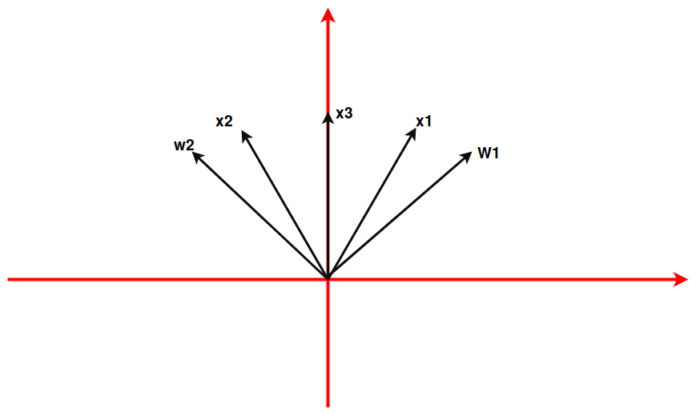
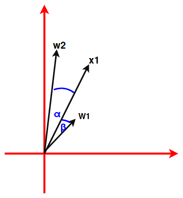
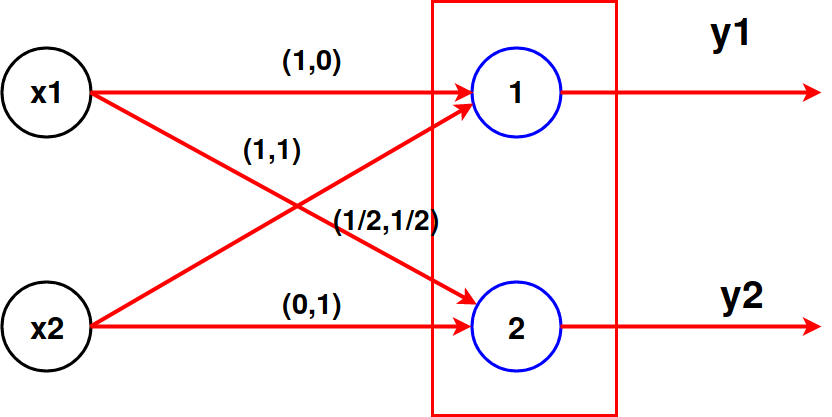
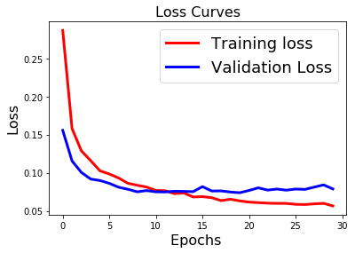
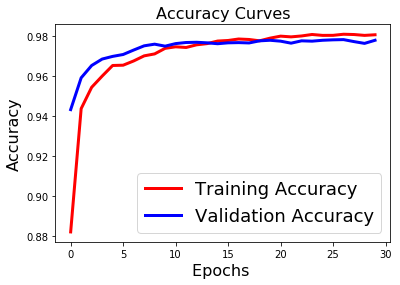
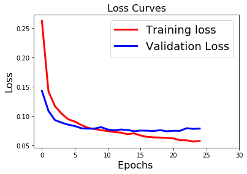
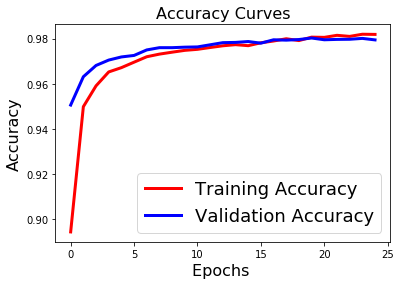

#\textcolor{blue}{Problema 1.1}


\begin{enumerate}[a)]

\item  El orden de presentación de los datos $x_1, ...., x_n$ a la red puede modificar el resultado de aprendizaje. Por ejemplo, se dispone de  tres datos cualesquiera $x^1,x^2,x^3$, situados en el plano de la siguiente forma:

\bminione
\begin{center}
```{r echo=FALSE, out.width='80%'}

```
\end{center}
\emini
\bminione
Figura 1: Esquema inicial para una RAC, se presentan los datos de entrada y  pesos iniciales.
\emini

En virtud de  la regla de aprendizaje de una RAC. Si $x_1$ es el primer dato a presentar, entonces $w^{1}$ se acercará  a $x_{1}$, pues la neurona $1$ será la ganadora, y luego lo será para $x_3$, debido a que estará mas cerca que $w^{2}$. En cambio, si $x_2$ es el primer dato a presentar, $w^2$ se acercará a $x_2$, entonces la neurona 2 será la ganadora para $x_3$. Por consiguiente, la secuencia $x_1,x_3,x_2$ genera un resultado de aprendizaje distinto de $x_2,x_3,x_1$.\newline

\item Se afirma que el valor inicial  de los pesos determina el resultado final del aprendizaje, por las mismas razones expuestas en a).\newline


\item  Para un dato $x^i$ distinto de calquier peso, su repetición  podría alterar el resultado de aprendizaje, ya que el peso $w^{k}$ asociado a la neurona ganadora se acercaría mas al dato $x^{i}$, lo que eventualmente podría provocar que otro dato $x^{j}\neq x^{i}$ deje de tener a la neurona $k$ como ganadora.


\item Considerar:\newline
\newline
\bminione
\begin{center}
```{r echo=FALSE, out.width='60%'}

```
\newline
Figura 2: $\Vert w^1 \Vert = 1 \neq  \Vert w^2\Vert$
\end{center}
\emini
\bminione
Claramente $\alpha > \beta$, pero $\Vert w^2-x_1 \Vert < \Vert w^1-x_1\Vert$, por lo tanto la neurona 2 será la ganadora. Si $w^{2}$ estuviera normalizado, ie $\Vert w^1 \Vert = \Vert w^2\Vert=1$, entonces la neurona 1 sería la ganadora, pues $w^{1}$ estaría mas cerca de $x_1$, al estar a menor angulo.
\emini
\end{enumerate}
\newpage


#\textcolor{blue}{Problema 1.3}
\begin{enumerate}[a)]

\item  Por demostrar que si cada par de entradas de la red tienen igual salida en una neurona de la capa escondida, entonces  $\exists w \in \mathbb{R}^{n}, k \in \mathbb{R}: <w,x>=k$.

Cada par de entradas $x,y$ tienen una salida  $ f(w_1^T y-\theta)=f(w_1^Tx-\theta)=C_1 \quad (\star)$, donde la función de activación es $f(x)= \dfrac{1}{1+e^{-x}}$ ($x \in \mathbb{R}$) y $C_1$ es cte en $\mathbb{R}$. \\

$f$ es inyectiva al ser estrictamente creciente ($\forall x \in \mathbb{R}:f'(x)=\dfrac{e^{-x}}{(1+e^{-x})^2}>0$), así ($\star$) implica que $\exists C_2 \in \mathbb{R}: C_2=w_1^Tx-\theta =w_1^Ty-\theta$. De aquí, se define $w:=w_1 \in \mathbb{R}^{n},\: k:=C_2+\theta\in \mathbb{R}$, obteniéndose que $\forall x,y \in \mathbb{R}^{n}: <w,x>=<w,y>=k$. Es decir, las entradas de la red pertenecen a un mismo hiperplano.\newline
\newline


\item  Considerar una RFBR, tal que una de sus neuronas de la capa escondida tiene función de activación $\phi (x)= \exp \left( \dfrac{-\Vert x-u\Vert^2}{2 \sigma^2}\right) $ y activación constante para toda entrada $x \in \mathbb{R}^{n}$. Se intenta demostrar que $\forall x \in \mathbb{R}^{n}:\Vert x-u\Vert =k_1 \quad (k_1=cte)$. 

Como la función de activación es inyectiva, y la neurona tiene activación constante para las entradas de datos, se sigue que $\exists C_1 \in \mathbb{R}: -\dfrac{\Vert x-u\Vert^2 }{2\sigma^2}=-C_1$, deduciéndose que $\forall x\in \mathbb{R}^n: \Vert x-u\Vert= \sqrt{(2\sigma^2 C_1)}=k_1$.\newline
\newline


\item Por demostrar que la superficies descritas en a) y b) coinciden para valores apropiados de los parámetros con datos normalizados ($\Vert x  \Vert=1$).


La superficie en  b) es  $S_B=\lbrace x \in \mathbb{R}^{n}:\Vert x-u\Vert^2=cte\rbrace$. Teniendo en cuenta:
$$\Vert x-u\Vert^2 =1-2<x,u> + \Vert u\Vert^2\implies <x,u>=\dfrac{1+\Vert u \Vert^2 - \Vert x-u\Vert^2}{2}$$

Se puede reescribir $S_B=\lbrace x\in \mathbb{R}^{n}:\; <x,u>=\dfrac{1+\Vert u \Vert^2 - k_1^2}{2}=cte, \; u \in \mathbb{R}^n\rbrace$. Por otra parte, en a) la superficie es $S_A = \lbrace x \in \mathbb{R}^n: \;<x,w>=k=cte, w\in \mathbb{R}^n\rbrace$. Por lo tanto, si 
$\dfrac{1+\Vert u \Vert^2 - k_1^2}{2}=k$, ie el valor $k_1=\sqrt{(2\sigma^2 C_1)}$ es apropiado, se tendrá que $S_B=S_A$.


\end{enumerate}


\newpage

#\textcolor{blue}{Problema 1.5}
Para un a RAC con entrada $x= (x_1,....,x_n)\in \mathbb{R}^{n}$, se define para cada neurona $i$ su potencial sináptico respecto a $x$ por:\newline
\newline

$$h_i(x)=\sum_j w_{ij}x_j - \dfrac{1}{2}\sum_j w_{ij}^{2}$$


\begin{enumerate}[a)]
\item  Por demostrar que  la neurona $k$, ganadora de la red (mayor potencial sináptico    ) con entrada $x$, es  equivalente a la neurona con vector
de peso asociado  más cercano (en distancia Euclidiana) al vector $x$.


 Aquella neurona  $k$ con mayor potencial sináptico, cumple que $\forall i \in \lbrace 1,...,m \rbrace :$
 $$\displaystyle \sum_{j} (w_{ij} x_j- \dfrac{1}{2} w_{ij}^2)\leq \sum_j (w_{kj} x_j -\dfrac{1}{2}w_{kj}^{2} )$$

Desarrollando $(w_{ij} - x_{j})^2$ y reemplazando en la desigualdad anterior  se obtiene que para todo\newline $ i \in \lbrace 1,...,m \rbrace: \displaystyle\sum_j \dfrac{-(w_{ij}-x_j)^2 + x_j}{2}\leq \sum_j \dfrac{-(w_{kj}-x_j)^2 + x_j}{2}$,\quad  equivalentemente: 


 

$$\forall i \in \lbrace 1,...,m \rbrace:  \sum_j (w_{kj}-x_j)^2 \leq \sum_j (w_{ij}-x_j)^2\overset{\star}{ \Longleftrightarrow} \forall i \in \lbrace 1,...,m \rbrace: \Vert w_k-x\Vert\leq \Vert w_i-x\Vert$$

En $\star$ recordar que $\Vert w_i-x\Vert=(\displaystyle\sum_j (w_{ij}-x_j)^2)^{1/2}$.\newline

\item Como ejemplo se propone el cjto de datos $\lbrace x^1,x^2 \rbrace \subset \mathbb{R}^{2}: x^1= (1,0), \; x^2=(0,\dfrac{1}{2})$ de salidas $y^1$, $y^2$. La RAC está dada por: \newline


\bminione
\begin{center}
```{r echo=FALSE, out.width='70%'}

```
\newline
Figura 3: RAC .
\end{center}
\emini
\bminione
Se observa que los pesos  asociados a cada neurona son $w_{11}=(1,0) ,\; w_{12}=(1,1),\; w_{21}=(0.5,0.5),\; w_{22}=(0,1)$.
\emini


Para el dato $x^1$ la neurona 1 es la ganadora, ya que $h_2(x^1)=0\leq 0.5=h_1(x^1)$, mientras que para $x^2$ se tiene: $h_1(x^2)=-0.5\leq 0=h_2(x^2)$, ie 2 es la ganadora. En resumen, los conjuntos $J_1=\lbrace 1\rbrace$,$J_2=\lbrace 2\rbrace$ son no vacíos, por ende no hay neuronas muertas.   
\end{enumerate}
\newpage
  
#\textcolor{blue}{Problema 2.1}

\begin{enumerate}[a)]
\item Los  problemas (i) y (ii) son  de tipo clasificación  en 2 categorías, por lo tanto ,en base a lo visto en clases, se propone entrenar y validar un modelo (a especificar mas adelante) con los datos de mnist\_train.csv para luego testear los datos de mnist\_test.csv, donde la variable a clasificar es  específica para cada problema (containers con mas de 5 pallets y cantidad par de pallets).\newline
\newline
\textbf{En cuanto al procesado de datos}, debido a que las imágenes están codificadas por pixeles que van entre 0 y 256, se propone normalizar para posteriormente usar una función de activación apropiada en la construcción del modelo ("relu" o "sigmoid"), mientras que para la variable label, según métodos de la literatura (y consejos del profesor) es conveniente usar una técnica de codificación  en una matriz binaria.\newline
Por ejemplo, para el vector $x=\begin{bmatrix}
1, 0, 3, 4\\
\end{bmatrix}$, la matriz binaria asociada es:


$$ \begin{bmatrix}
0 &  1 &  0 &  0 &  0 &  0\\
1 &  0 &  0 &  0 &  0 &  0\\
0 &  0 &  0 &  1 &  0 &  0\\
0 &  0 &  0 &  0 &  1 &  0
\end{bmatrix}$$

Donde, cada componente del vector $x$, esta representada en cada fila de la matriz, con un 1 en la i-ésima posición igual al valor  de la componente del vector. 
  


\item  \textbf{En cuanto al modelo}: para ambos problemas se usó una arquitectura de red de tipo secuencial, que consta de 2 capas, una de entrada (con 80 neuronas para el problema (i), y 70 para el (ii) ) y una capa de salida de 2 neuronas en ambos casos, ya que en ambas instancias se deseaba clasificar en 2 categorías. Entre las capas de entrada y salida, se agregó una capa dropout ( método que desactiva un número de neuronas de la red  de forma aleatoria.)\newline
\newline
Las funciones de activación son sigmoid (logística) para la capa de entrada, ésta función es apropiada al momento de trabajar con datos normalizados, puesto  que se mueve entre 0 y 1.
Para la capa de salida la función de activación es softmax, propuesta en clases para problemas de este tipo. Es válido mencionar, que se probó con sigmoid como función de salida y los resultados fueron similares a los obtenidos con softmax.\newline
\newline
El principal desafío en la elección de la arquitectura de la red y parámetros, fue esquivar el overfitting y underfitting (temas a abordar mas adelante), es por esto que después de varios intentos con distintos parámetros y arquitectura, se escogió el diseño de red antes descrito con una cantidad de épocas y batches iguales a 30 y 200 para el problema (i). Para el problema (ii), 25 y 200 fueron epocas y batches requeridos. 


\item Para el problema (i) y (ii) la funciones de pérdida y métrica son categorical\_crossentropy  y accuracy respectivamente. \newline


\item  El \textbf{overfitting} se da  cuando un modelo es mucho mejor en el conjunto de entrenamiento que en el conjunto de validación, es decir en cierta forma se están  memorizando ejemplos de entrenamiento. De esa manera, se   predicen bien los datos de entrenamiento (precisión alta), pero no se generaliza el modelo y, por lo tanto, falla en algunos casos. Por otra parte,
si nuestros datos de entrenamiento son muy pocos nuestra máquina no será capaz de generalizar el conocimiento y estará incurriendo en \textbf{underfitting}, fenómeno por el cual se tuvo sumo cuidado al trabajar, por eso se escogió un 70\% de datos para entrenar y el resto para validación. 
\newpage

Para ambos problemas, se puede apreciar en las gráficas de pérdidas, que los valores de pérdida (validation loss) se estabilizan en la medida que la función de pérdida de entrenamiento decrece, esto se logró, alterando parámetros del modelo y arquitectura, teniendo en consideración que una gráfica de los valores de pérdidas creciente "podría" significar que el modelo cae en overfitting. También se puede observar, que en la gráfica de precisiones, la precisión de validación (validation acurracy) tiende a acercarse mucho a la precisión de entrenamiento.\newline
En resumen, el desempeño del modelo para la validación es similar al obtenido en entrenamiento, lo cual permite calificarlo como bueno o apto para el testeo. \newline
\newline


\end{enumerate}


\bminione
\begin{center}
```{r echo=FALSE, out.width='70%'}

```
\newline
Figura 4: Gráfica de la función de pérdida, problema (i).
\end{center}
\emini
\bminione
\begin{center}
```{r echo=FALSE, out.width='70%'}

```
\newline
Figura 5: Gráfica de la precisión, problema (i).
\end{center}
\emini


\bminione
\begin{center}
```{r echo=FALSE, out.width='70%'}

```
\newline
Figura 6: Gráfica de la función de pérdida,problema (ii).
\end{center}
\emini
\bminione
\begin{center}
```{r echo=FALSE, out.width='70%'}

```
\newline
Figura 7: Gráfica de la precisión, problema (ii).
\end{center}
\emini


